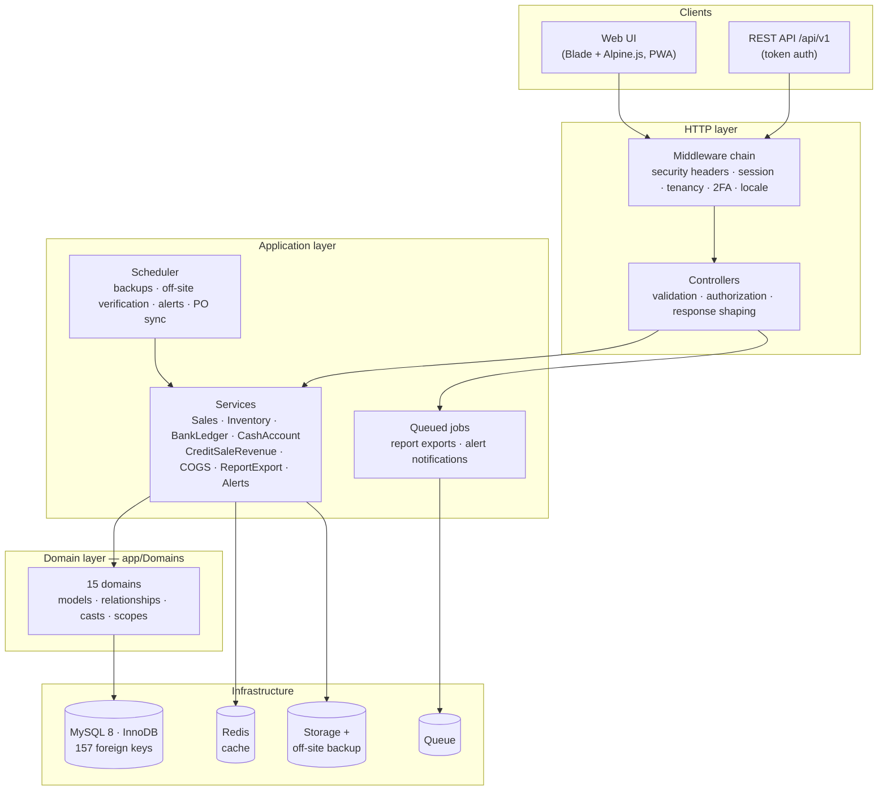
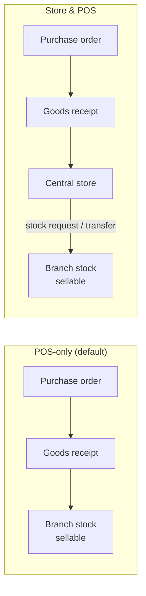

# Architecture

HOROOMART is a modular monolith: one deployable Laravel application, organized internally into
bounded domains that own their models and rules. The design favours correctness and
operability on modest infrastructure over distributed complexity. A single application server,
one MySQL database and a Redis cache carry a multi-branch business.

## Layered structure

**Controllers** stay thin. They validate input, authorize the action against a permission, and
delegate. **Services** own every multi-step operation that must be atomic, anything touching
stock or money in particular, and run inside database transactions. **Domain models** own
relationships, casts (including encryption at rest) and query scopes.

## Domains

| Domain | Responsibility |
|---|---|
| **Organization** | Tenants, branches (points of sale), stores (warehouses), per-organization settings |
| **User** | Users, organization-scoped roles, permissions, trusted devices |
| **Inventory** | Items, categories, manufacturers, per-location stock, every stock movement document |
| **Procurement** | Purchase orders, approval, receiving, payment status |
| **Supplier** | Supplier master data |
| **Sales** | POS sales, credit sales, instalment collections |
| **Customer** | Customer records (contact details encrypted at rest) |
| **Financial** | Banks & wallets, ledger transactions, payment methods, transfers, expenses, personal finance |
| **Loans** | Loans, instalment schedules, authorized users |
| **HR** | Employees, payroll runs and lines |
| **Assets** | Fixed-asset register |
| **Alerts** | Alert log for due-date and operational notifications |
| **Reports** | Asynchronous export jobs |
| **AI** | Demand forecasting model and analytics service |
| **Shared** | Cross-cutting audit log |

The complete schema for each domain is in [../database/SCHEMA.md](../database/SCHEMA.md), and the
relationships are drawn in [../database/ERD.md](../database/ERD.md).

## Multi-tenancy

HOROOMART uses **shared-database, row-level tenancy**. Every business table carries
`organization_id`, backed by a real foreign key.

- `EnsureUserHasOrganization` rejects any authenticated request from a user not bound to a tenant.
- `EnsureUserHasBranch` binds operational users to their branch.
- A shared query scope (`StoreOrBranchScope`) restricts operational data to the user's own
  branch or store, unless their role grants organization-wide visibility.
- Document numbers are unique **per organization**, so tenants never collide or leak
  sequence information to each other.
- Cache entries are namespaced per organization (`OrgCache`), with version-key invalidation
  that works on any cache driver.
- Roles are organization-scoped, so each tenant defines its own role structure.

### Two operating models

Each organization picks how stock enters the business:

*Store & POS* adds a control point: goods are checked into a central store by a stock keeper
and issued to branches on request. Stock can't reach a point of sale without an auditable
transfer.

## Request lifecycle

The `web` middleware group runs in a deliberate, test-locked order:

1. **Security headers.** Content Security Policy (no `unsafe-eval`), frame, content-type
   and referrer protections.
2. **Session and CSRF.**
3. **Organization security settings.** Per-tenant policy such as session lifetime.
   It runs after the session is resolved, so policy can read and act on it.
4. **Locale.** English, Amharic or Afaan Oromoo, chosen per session.
5. **Tenancy guards.** Branch, then organization.
6. **Two-factor verification.** A session that has passed the password but not the second
   factor reaches nothing else.
7. **Forced password change.** Users flagged to change their password (for example after an
   admin reset) are held until they do.

An automated test asserts this ordering. Reordering middleware is a classic source of silent
security regressions, so it is treated as a contract.

## Background processing

| Mechanism | Used for |
|---|---|
| **Queued jobs** | Report exports (PDF / Excel / CSV) and alert delivery. Long reports never block a request or hit a timeout. Each export's status (queued, completed, failed) is tracked, and the file is downloadable from the exports page once ready. |
| **Scheduler** | Daily database backup with 14-day retention · daily verification that the off-site copy exists and is intact · daily due-date alerts · hourly purchase-order payment-status reconciliation |
| **Operational alerting** | A failed backup or a failed off-site verification alerts administrators directly, so a broken safety net is noticed the same day rather than on the day it's needed. |

## Integrations

| Integration | Purpose |
|---|---|
| **REST API** (`/api/v1`, Sanctum tokens) | Item catalogue, sale creation, analytics (sales trends, anomalies, demand forecast) |
| **Mobile money** | Wallet-type accounts (e.g. Telebirr) act as first-class settlement accounts |
| **Email (SMTP)** | Password resets, due-date alerts, operational alerts |
| **WhatsApp** (Twilio) | Due-date alerts |
| **SFTP** | Off-site backup replication |

## Frontend

Server-rendered Blade templates with Alpine.js (the CSP-compatible build, which allows a
strict Content Security Policy) and Tailwind CSS, bundled by Vite. The application is
installable as a **Progressive Web App**. The POS keeps working through connectivity loss:
failed checkouts are queued locally and replayed on reconnect, and the checkout's idempotency
key makes a replay of an already-recorded sale a harmless no-op.

## Analytics

Demand forecasting trains a regularized (ridge) linear regression per item on the
organization's own sales history. The model is implemented in-house, with no external ML
service or data leaving the tenant. It is backed by unit tests that verify it recovers known
relationships and regularizes correctly. Sales-trend and anomaly analyses feed the dashboard
and the API.

## Known design boundaries

Stated plainly, because they shape what the system is suited for:

- **Account ledger, not a general ledger.** Money is tracked as running balances per bank,
  wallet and cash account, with a full transaction trail (see
  [FINANCIAL_INTEGRITY.md](FINANCIAL_INTEGRITY.md)). There is no chart of accounts or
  double-entry journal. That suits retail operations; formal accrual accounting belongs in a
  dedicated accounting system or a future GL module.
- **Single-region, single-database.** Scaling is vertical plus caching. The schema is fully
  indexed for its reporting paths, but horizontal sharding is not a goal.
